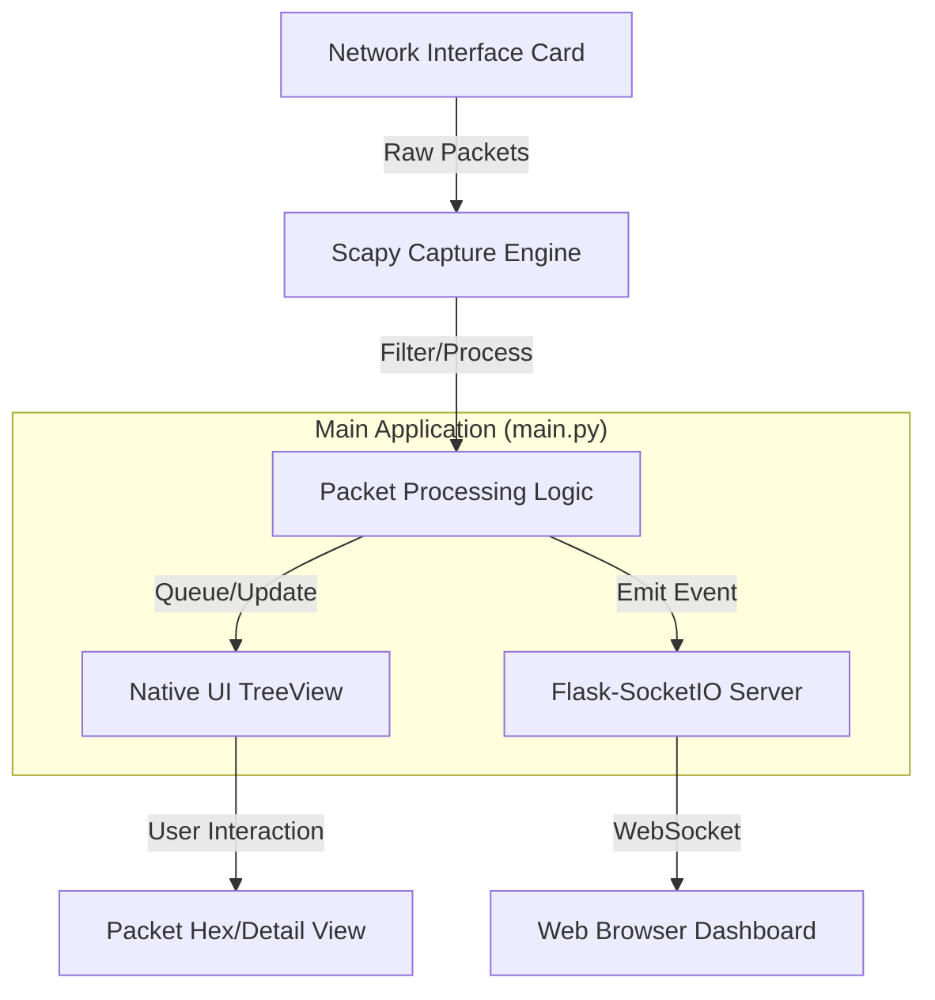

# 🏗️ Architecture: Network Sniffer Pro

Network Sniffer Pro is designed as a multi-threaded application that combines high-performance packet interception with two distinct user interfaces: a native desktop GUI and a web-based dashboard.

## 🧱 Core Components

### 1. Packet Capture Engine (`Scapy`)
The heart of the application is the `sniff_packets` function in `main.py`, which utilizes the `Scapy` library. 
- It operates on a background thread to prevent blocking the UI.
- It applies real-time filtering (IP/Protocol).
- It performs credential scanning on unencrypted payloads (HTTP, FTP, etc.).

### 2. Dual User Interfaces
- **Native UI (`CustomTkinter`):** Provides a high-performance Windows-native experience for local monitoring. It uses a `ttk.Treeview` for displaying packets.
- **Web Dashboard (`Flask` + `SocketIO`):** Enables remote or browser-based monitoring. It pushes packets to the browser in real-time using WebSockets.

### 3. Web Server (`Flask`)
A built-in Flask server runs on port `5000`. 
- **Routes:** `/` serves the `index.html` dashboard.
- **SocketIO:** Handles the real-time stream of packet data from the capture engine to any connected browser clients.

## 🔄 Data Flow

## 🧵 Threading Model

To ensure a smooth user experience, the app manages three primary threads:
1. **Main Thread:** Handles the Tkinter event loop (GUI).
2. **Flask Thread:** Runs the Flask/SocketIO web server.
3. **Capture Thread:** Dedicated to sniffing and processing packets.

## 📁 Project Structure

- `main.py`: Entry point, UI logic, and capture management.
- `templates/`: HTML/JS for the web dashboard.
- `requirements.txt`: Python dependencies.
- `main.spec`: Build configuration for PyInstaller.
